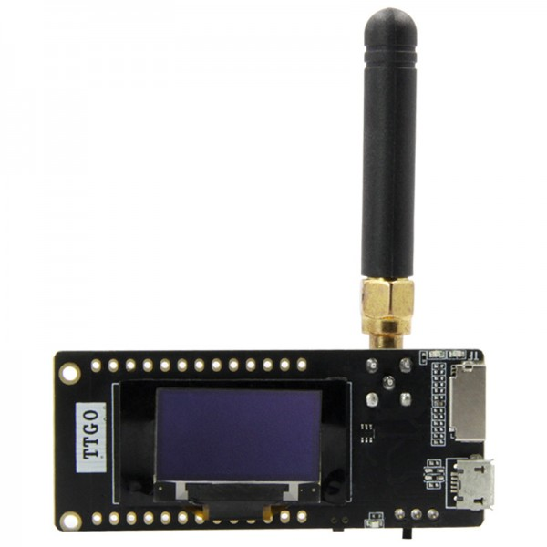
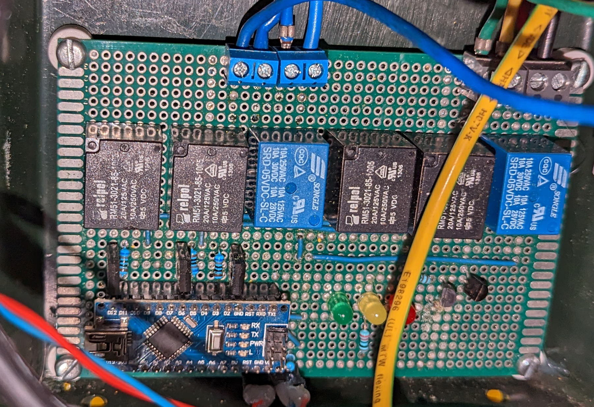
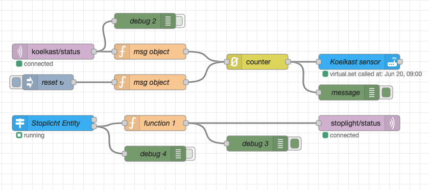

# Connecting long range sensors using LoRa and MQTT

This post is written as part of an assignment for the HAN University of Applied Sciences. This is also part of a few other projects I am posting.
Other guides can be found here:\
Two Zigbee Networks Joined over a wireguard VPN: `TBD`\
Controlling Tuya devices locally using Node-Red:`TBD`

This guide presumes that you have some basic knowledge of using Home-Assistant and that Home-Assistant is already installed. I am not liable for broken devices, broken configuration, thermonuclear war or ANYTHING ELSE. This guide is provided as is. Nonetheless I hope you find it interesting :D

# Introduction
Unlike the other posts I made. This isn't a guide but more of an exploration of what is possible. At this point with my Home-Assistant installation I could add Zigbee devices and Wi-Fi devices and sensors at my own studio and at my parents place which is connected through a VPN. However I couldn't put sensors in the yard of my parents or put a device at a long-range without an internet connection or Zigbee Signal from either gateways.\
That is why I decided to explore with a Point to Point LoRa connection. I Have used used LoRaWAN with The Things Network, but neither my parents place or my own studio have very good coverage of TTN. So I bought to ESP32 modules with a SX1276 Lora chip and went coding.

## LoRa
LoRa stands for Long Range and is specifically designed to send data over longer distances upto 5km. It is mostly used by LoRaWAN networks like the things network. More information on LoRa can be found [here](https://lora-alliance.org/) and more information on The Things Network can be found [Here](https://www.thethingsnetwork.org/)

## Goal of this project
The point of using LoRa is to get a longer range. So I wanted to see how far I could get in a semi urban area with some lower power modules.

# Modules
I opted to buy two LilyGO TTGO T3 LoRa32 V1.6.1 ESP32 Modules. With some cheap antenna's from amazon not for extended range but more for antenna placement.\


# The Project
A few years ago I made a small joke project in where a traffic light was hooked up to fridge. When the fridge would open the traffic light would go to green and cycle back through orange and eventually to Red.
This was controlled by Arduino Nano which which would constantly read a digital pin to check if the fridge light was activated. If the fridge light turned on the pin would go high and the light would turn green.

## Hardware
The Hardware consist of Node and Gateway.

### The Node
The Board that controlled the traffic light becomes the node and originally looked like this:



There are two relays to switch live and neutral wires per light so six relays in total. The Red light has inverted logic because that is light that is almost always on since the fridge is closed most of the time so no relays are active.
The relays are controlled using BJT transistors .There are debugging LED's on the board for programming the board if it is removed from the traffic light.

This meant that the board was almost ready only the pins for had to be mapped to appropriate pins on the LilyGo.\
The pinout for this was changed as follows:

| **Function**          | **Arduino Nano Pin**       | **LilyGO Pin**    |
|-                      |-                           |-                  |
| Green light           | D11                        | GPIO12            |
| Yellow Light          | D5                         | GPIO13            |
| Red light (inverted)  | D2                         | GPIO15            | 
| Fridge Read Pin       | A2                         | GPIO2             |

After some more soldering with protoboard it looked like this:\


### The Gateway
The Gateway is just the LilyGo module described earlier that is connected to a Wifi Network.
The Node and Gateway are about 1 km apart from each other. The Gateways job is to translate MQTT message into LoRa messages.
# Software Design
There are two pieces of different software written. The Node is in control of traffic light and The Gateway is in control of processing MQTT messages and sending them over LoRa.
## The Node
The Node can control the traffic light in three Modes: Manual, Automatic and Flicker
### Manual
In the manual mode you can select a color from the Home Assistant color wheel. Green controls the green stoplight, red Controls the red stoplight, and blue controls the yellow stoplight.\
The Rreason that blue is controlling the yellow light is so that there is finer control after all and there is no blue light in the traffic light so nothing goes to waist. It also easier to code since each light has its own value from `0` to `255`
However the light are binary. This means that they either on or off. So I mapped that above `200` the light is `on` and below `200` the light is `off`
### Flicker
Flicker is essentially the same as the manual mode only that the light flickers at the selected color with an interval of `1` second.
### Automatic
The Automatic mode is the original function of the traffic light. This means when the fridge is opened it is turning the light green and when it closes it turns the light to orange and then red on an interval of `2` seconds.

### Counting how many times the fridge has opened
Whenever the fridge is opened it stores it in ringbuffer. When the transmit interval occurs for LoRa it sends back a ping that the fridge has opened. This is then turned back into a MQTT message and registered by node red to the a virtual sensor.

## The Gateway
The Gateway checks if there is an MQTT message
# Software implementation

## Node-RED and Home Assistant
For this to be controlled from Home Assistant I wanted to control it from MQTT. But since I don't really like the normal MQTT Light implementation I opted to use A virtual light in combination with Node-Red. See my guide on controlling Tuya light were I basically did the same thing. But in short I created a fake light and sensor with the virtual HACS plugin you can find [here](https://github.com/twrecked/hass-virtual)\
The config for the virtual light looks like this:
```yaml
- platform: virtual
  name: Sociale Leven Stoplicht
  initial_value: "on"
  initial_brightness: 100
  support_color: true
  initial_color: [0, 100]
  support_effect: true
  initial_effect: "Automatic"
  initial_effect_list: ["Automatic", "Flicker", "Manual"]
```
The config for the virtual sensor looks like this:
```yaml
- platform: virtual
  name: "Sociale Leven Koelkast"
  initial_value: 0
  initial_availability: true
  unit_of_measurement: "x Opened"
```
From here I created Node-Red Flow:\
\
This flow can be found in my github [here](https://github.com/Digitalralf/Home-Assistant-Projects/blob/main/LoRa-MQTT%20Sensors/Flow/Traffic%20light%20flow.json)

For example if I set it to the mode to manual and choose green as a color it sends the following JSON:
```json
{
   "state":"on",
   "mode":"Manual",
   "red":false,
   "green":true,
   "yellow":false
}
```
In the reverse direction a single message is incremented by a counter in Node-RED and that updates the virtual sensor.

## Node
The nodes implementation can be found in my github repository [here](https://github.com/Digitalralf/lora-stoplight/tree/main/node).\

### Unpacking LoRa messages
```C++
void loop() 
{
  if (millis() - lastSendTime > transmitIntervalMs) {
    TransmitFridgeOpened();
    lastSendTime = millis();            // timestamp the message
  }
  CheckForPacket();
}
```
Unpacking LoRa Messages looks like this:
```C++
void CheckForPacket()
{
  if (LoRa.parsePacket()) 
  {
    unpackedMessage_t unpackedMessage;
    uint8_t message = 0;
    while (LoRa.available()) 
    {
      message = (uint8_t)LoRa.read();
      unpackedMessage = ParseLoraMessage(message);
    }
    if(unpackedMessage.mode == AUTOMATIC)
    {
      SetStopLightAutomatic();
    }
    if(unpackedMessage.mode == FLICKER)
    {
      SetStopLightFlicker(unpackedMessage.color.red, unpackedMessage.color.yellow, unpackedMessage.color.green, 1000);
    }
    if(unpackedMessage.mode == MANUAL)
    {
      SetStopLightColors(unpackedMessage.color.red, unpackedMessage.color.yellow, unpackedMessage.color.green);
    }
  }
}
```
The main loop is checking constantly if a LoRa packet has arrived or if it needs to send a LoRa packet. If a LoRa packed arrived it unpacks it. A LoRa packet consists of a singular byte and looks like the following:\

<table>
<thead>
  <tr>
    <th>Bit</th>
    <th>8</th>
    <th>7</th>
    <th>6</th>
    <th>5</th>
    <th>4</th>
    <th>3</th>
    <th>2</th>
    <th>1</th>
  </tr>
</thead>
<tbody>
  <tr>
    <td>Data</td>
    <td colspan="3">Empty</td>
    <td colspan="2">Mode</td>
    <td>Green</td>
    <td>Yellow</td>
    <td>Red</td>
  </tr>
</tbody>
</table>

All data fits into 5 bits. For every light a `1` represents `on` and `0` means `off`.\
The modes are encoded as follows:
- `00` for automatic
- `01` for manual
- `10` for flicker
- `11` is invalid.

### Automatic Mode
In the original implementation of the traffic light. The loop would constantly check if the fridge had opened. Since the loop is now fully occupied by checking if there is LoRa packet this is no longer possible.
This functionality is now rewritten on a interrupt bases. And it works like this:
The fridge detection pin is connected to an interrupt service routine that checks when the pin rises. To mitigate noise there is FreeRTOS timer of 20ms. After these 20ms have passed a function is called to check if the Pin is still high. This is done because sometimes there can be noise which will trigger the pin. This noise can for example be created by switching on and off devices which inducts current into the wire that runs from the fridge to the traffic light. It essentially a software debounce function.

A Timing diagram looks like this:\
\

The checking for closing the fridge works in the same way, but there HIGH and LOW states are switched. The Red Light activates after two second timer so there is no debounce implementation for that

### Manual Mode
Manual mode sets the corresponding bits for red, yellow and green to the output. 
### Flicker
Flicker does the same as manual. But it alternates between off and on states by invoking a FreeRTOS timer which will switch the state when the timer times out.

## The Gateway
The Job of the Gateway is to listen for MQTT Messages and Listen For Lora Messages that it can receive. Once it finds an MQTT Message it will translate from the JSON mentioned above to the single byte discussed above.
MQTT message are received on interrupt bases. Once A message is received it will parse it. The parsing function looks like this:
```C++
uint8_t parseToByte(mqttMessage_t inComingMessage)
{
    const static uint8_t redBitMaskOn    = 0b00000001;
    const static uint8_t yellowBitMaskOn = 0b00000010;
    const static uint8_t greenBitMask    = 0b00000100;
    
    
    const static uint8_t AutomaticModeBitMaskOn     = 0b00000000;
    const static uint8_t ManualModeBitMaskOn        = 0b00001000;
    const static uint8_t FlickerModeBitMaskOn       = 0b00010000;

    const static uint8_t offMessage = ManualModeBitMaskOn;

    uint8_t DataByte = 0b00000000;
    if(inComingMessage.state == ON)
    {
        if(inComingMessage.color.green == true)
        {
            DataByte = DataByte | greenBitMask;
        }
        if(inComingMessage.color.red == true)
        {
            DataByte = DataByte | redBitMaskOn;
        }
        if(inComingMessage.color.yellow == true)
        {
            DataByte = DataByte | yellowBitMaskOn;
        }

        switch (inComingMessage.mode)
        {
            case AUTOMATIC:
                DataByte = AutomaticModeBitMaskOn;
                break;
            case MANUAL:
                DataByte = DataByte | ManualModeBitMaskOn;
                break;
            case FLICKER:
                DataByte = DataByte | FlickerModeBitMaskOn;
                break;
            default:
                DataByte = offMessage;
                break;
        }
    }
    else
    {
        DataByte = offMessage;
    }
    return DataByte;
}
```
At the top some bitmasks are seen. These bitmasks are set depending on the data in the JSON that is received. It is then translated to a single byte of data. Since LoRa is very low bandwidth we cannot send entire strings across it
If you want a deeper dive into the code it can be found on my github page. Note that I will probably be updating the code over the following weeks to tweak some things here and there.

## Youtube Videos
I Have posted some unlisted youtube videos of it working:
[Changing the color of the traffic light](https://www.youtube.com/watch?v=O5E9kfEw_Kc)
[Video 2]()


# LoRa Spectrum and Legality
Since you are sending over a free part of the frequency spectrum there are limitations on how much power you can use on the band. The restrictions in the Netherlands for 868MHz band are a max sending power of 25mW and only sending at 1% duty cycle. This is to ensure that the band is not to crowded. The 1 km was at the edge of what I could reach. Since I couldn't put the antenna outside of the buildings I had to resort to a spreading factor of 10 at the maximum sending power. However with a standard pre-amble of 12.25 and one byte this means that I could only send 1 Message per 24 seconds. If you copy this project keep this in mind. **I am not liable for you breaking broadcasting laws in your country**

# Short comings/future additions of this Project
Since I didn't make use of LoRaWAN. There is no encryption and technically anyone can listen or sabotage the message stream. There is also no addressing. So if anyone is using the same frequency band and channel you can get garbage data. This can be mitigated by implementing some form of addressing and maybe even encryption.


