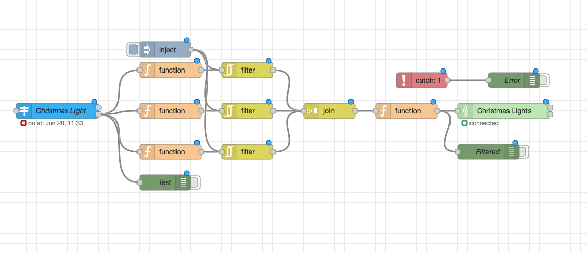

# Controlling Tuya devices locally using Node-Red

This post is written as part of an assignment for the HAN University of Applied Sciences. This is also part of a few other projects I am posting.
Other guides can be found here:\
Two Zigbee Networks Joined over a wireguard VPN: `TBD`\
Connecting long range sensors using LoRa and MQTT:`TBD`

This guide presumes that you have some basic knowledge of using Home-Assistant and that Home-Assistant is already installed. I am not liable for broken devices, broken configuration, thermonuclear war or ANYTHING ELSE. This guide is provided as is. Nonetheless I hope you find it interesting :D

# Introduction

A long time ago, once close to christmas I bought LSC chirstmas ligths in the hope I could connect them to my Home Assistant installation, however this turned out to be quite challenging. I have compiled everything I learned from that experience in this guide and used the christmas lights as an example.

## Tuya
Tuya is chinese manufacturer which makes a lot of smarthome equipment. A lot of cheap smarthome equipment is based on Tuya devices. For example in the Netherlands devices from the Lidl and Action almost always use Tuya Devices exclusively. The Lidl and Action smarthome apps are also based on the Tuya App.

### Tuya chips

Quite a while ago Tuya devices switched from using ESP based chips to their own produced chips. This makes it impossible to flash existing devices with for example an ESPHome solution. Instead of just changing the chip, this post aims to get to a solution without changing any hardware or firmware and controlling the existing Tuya firmware from software locally without a cloud solution.

## Node-RED
Node-RED is a node based node based programming tool which works with topic and messages. More information can be found [here](https://community.home-assistant.io/t/home-assistant-community-add-on-node-red/55023)

## Local Tuya/ Tuya intergration

Basic devices like switches and lights can be controlled using the Tuya integration or Local Tuya integration. I would recommend using the Local Tuya integration and try and see if that would solve your problem. I use it myself to control a couple of switches and like it very much. However there are some Tuya devices that have alternative datapoint settings and aren't supported using the normal Tuya integration or Local Tuya.

Local Tuya integration can be installed using the HACS store and can be found here:
https://github.com/rospogrigio/localtuya

# Prerequisites

In this guide several tools are used to extract keys, determining datapoints and controlling the Tuya devices. To follow this guide it is required to use a rooted android device or the use an emulator. If you want to extract the keys without making a Tuya developer account. It does still require a tuya or smartlife account.

| **What**              | **Why**                    | Optional    | Where to Find
|-                      |-                           |-            |-
| Node-Red              | Making Flows               | No (duh)    | Add-On store HomeAssistant: https://community.home-assistant.io/t/home-assistant-community-add-on-node-red/55023
| HACS                  | Getting Node-RED Companion | No          | Website: https://hacs.xyz/docs/setup/download
| Node-Red Companion    | Reading entities           | No          | HACS: https://github.com/zachowj/hass-node-red
| Hass-virtual          | Creating an entity in HA   | No          | HACS: https://github.com/twrecked/hass-virtual
| Node-Red Tuya node    | Controlling Tuya Devices   | No          | Node-Red Settings: https://flows.nodered.org/node/node-red-contrib-tuya-smart-device
| Python3               | Installing Tiny Tuya       | No          | Website: https://www.python.org/downloads/
| TinyTuya              | Testing Datapoints         | No          | Can be instaled using `pip install tinytuya`, More info: https://pypi.org/project/tinytuya/
| Smartlife 3.6.1 app   | Extracting Tuya keys       | Yes         | APK-Mirror: https://www.apkmirror.com/apk/volcano-technology-limited/smart-life-smart-living/smart-life-smart-living-3-6-1-release/smart-life-smart-living-3-6-1-android-apk-download/
| Bluestacks 5          | Extracting Tuya keys       | Yes         | Website: https://www.bluestacks.com/ Can also be downloaded from the bstweaker site.
| Bluestacks Tweaker    | Extracting Tuya keys       | Yes         | Website: https://bstweaker.tk/ (select download 2)


### Node-RED
Since this entire guide is aimed at Node-Red you need it. It can be directly installed from inside Home Assistant from `Settings -> Add-Ons -> Add-On Store -> Node-RED`

### HACS
HACS stands for: Home Assistant Community Store. It is aimed at providing user created integrations for everyone to install. To install HACS follow [this](https://github.com/zachowj/hass-node-red) guide.


### Node-RED Companion
Node-RED companion is used to control components from home assistant as nodes in Node-RED. More info can be found [here](https://github.com/zachowj/hass-node-red)

### Hass-virtual
Hass-Virtual is a custom integration and can be used to make fake entities in home-assistant. This can be used as an alternative of using templates. I like it personally since it is very easy to configure and is very usable with Node-RED.


### Node-Red Tuya node
The Node module name is: `node-red-contrib-tuya-smart-device` and can be installed in the node-red settings by putting the module name into `npm_packages`
This is a node that gives access to the tuya device by specifying the id, key and ip address of the devices. With this node datapoints can be set using flows.

### Python3
For using TinyTuya is a python library. For Windows you can download from the [website](https://www.python.org/downloads/). For linux you can use the package manager of your distro. Fo mac you can use `brew` or `macports`

### TinyTuya
TinyTuya is a python library and can be used for controlling python devices. It can be installed using the python package manager: Pip. To install TinyTuya use the command: `pip install tinytuya`

## Optional Components
The following tools are used for retrieving tuya keys and getting the datapoints. There are also other ways to get the Tuya keys with Tuya local. This however involves creating a developer account on the Tuya Developer website. Datapoints can also be found and set using Tuya Local, however I didn't find this intuitive.

### Smartlife 3.6.1 app
The Smartlife app is a clone of the tuya application. This specific version of the app contains a bug which dumps the local keys of the device when connecting the device to the app. However to get these keys it requires you to have a rooted android device since that part of storage is inaccessible.

### Bluestacks 5 and BlueStacks Tweaker
These are only required to have if you are not willing to root you android phone or don't have an android phone. This will be used to install the smartlife app and extract the keys 


# Step 1 - Tuya keys
To control Tuya devices locally the first step is to extract the local keys. There are essentially two ways of getting the Tuya keys from devices.

## Method 1

One way to get the keys is to create a Tuya Developer account and couple the devices to that account. You can extract the keys that way. I found it cumbersome to use, however the method has become easier to use since the last time I have tried it. A comprehensive guide can be found on the github page of the Local Tuya HACS component [here](https://github.com/rospogrigio/localtuya#adding-the-integration)


## Method 2

Another method is to use the Smartlife 3.6.1 app on a rooted android device. This method is described by **Mark Watt Tech** in his youtube video which can be found [here](https://www.youtube.com/watch?v=YKvGYXw-_cE). It does require you to create a (throwaway) smartlife account.\
I will give a short summary here for the sake of having some written steps. I presume you use a windows machine with BlueStacks and BlueStack Tweaker already installed

1. Install the Smartlife 3.6.1 apk inside bluestacks and the smartlife app on your phone.
2. Start the app on your phone and create a smartlife account.
3. Connect the Tuya devices to your smartlife account.
4. Start the smartlife app on bluestacks and login with your account and wait for your devices to load.
5. Close the app and exit bluestacks. They keys are now extracted.
6. Open Bluestacks tweaker and click on `File Manager`
7. Navigate to `data/data/com.tuya.smartlife/shared_prefs/`
8. Copy the key file with numbers attached. It looks somehting like this  `preferences_global_keyeu1545...xml` DO NOT USE  `preferences_global_key.xml`
9. Open the file in a text editor search for `LocalKey` and look for the entry. You can also use the tool made by Mark on his github which extracts the keys automatically that can be found [here](https://github.com/MarkWattTech/TuyaKeyExtractor)

# Step 2 - Finding Datapoints

Tuya devices use datapoints this means that there is a number with a corresponding value. That value can be a number a string or anything device specific.
To get the datapoints we use TinyTuya to read out the state of the device. 
For this step we are going to use TinyTuya and the smartlife app we installed earlier.

Look at the prerequisites for installing TinyTuya. Once TinyTuya is installed you should use `python -m tinytuya scan` to scan for devices. Don't actively connect to the device at that moment with the smartlife app. If it is not picked up try to powercycle the device without using the smartlife app.

When you have found the device write down the `Device ID` and `IP Address`. We will need them for the next step including with the local key we found earlier.\
To get the datapoints we have to use a python script like this:

```python
import tinytuya

device = tinytuya.Device('DEVICE_ID', 'IP_ADDRESS', 'LOCAL_KEY')
device.set_version(TUYA_VERSION)
status = device.status()
dps = device.detect_available_dps() 
print('Device status: %r\n' % data)
print('DPS Availible: %r\n' % data)

```
This script is also available from my github page [here](https://github.com/Digitalralf/Home-Assistant-Projects/blob/main/Node-Red%20Tuya%20Devices/Python%20Scrips/getInfo.py)

To get datapoints from the device do the following:

1. Open the smartlife app and turn on the device
2. Close the app
3. Run the python script
4. Repeatedly run the script with cycling through all the settings that are available for the device
5. Write down every setting that is possible for every datapoint.

## Example
When trying this out on my christmas lights I get the following output and 

```bash
$ getinfo.py
Device status {'devId': 'DEVICE_ID', 'dps': {'20': True, '101': 'Color', '102': 'Stream'}, 't': 577}
Available DPS{'20': None, '101': None, '102': None}
```
Here we can see the datapoints that the device uses.
For every datapoint the following modes are available:

| **Datapoint** | **20** | **101** | **102**   |
|---------------|--------|---------|-----------|
| **Mode**      | True   | Color   | Bright    |
|               | False  | R       | Gradually |
|               |        | G       | Star      |
|               |        | B       | Flower    |
|               |        | RG      | Marquee   |
|               |        | RB      | Fireworks |
|               |        | GB      | Meteor    |
|               |        | RGB     | Stream    |

Now we know everything from the tuya device we need to know

# Step 3 - Virtual Device

Using the HACS virtual device integration it is very easy to create a fake entity in Home Assistant. To see all supported entities visit the github page [here](https://github.com/twrecked/hass-virtual)

## Example
For the christmas lights I configured the modes according to the datapoints as follow in my `lights.yaml`:
```yaml
- platform: virtual
  name: "Christmas Lights"
  initial_value: "on"
  initial_brightness: 100
  support_color: true
  initial_color: [0, 100]
  support_effect: true
  initial_effect: "Stream"
  initial_effect_list:
    [
      "Bright",
      "Gradually",
      "Star",
      "Flower",
      "Marquee",
      "Fireworks",
      "Meteor",
      "Stream",
    ]
```
This creates an entity inside Home Assistant after a restart

# Step 4 - Node-Red Flow

This step is very specific to your application and device that you are using. Atleast two nodes are required to hook up the virtual device and the tuya device. For getting the data from virtual device the `state node` is required. For controlling the tuya device `tuya-smart-device node` is required. \
The state node requires the virtual device entity to which should be filled in the `Entity` field.\
The tuya node requires the `Device ID` or `IP Address` and the `Local Key` from earlier.

## Example 
The flow for my christmas lights can be found on my github page [here](https://github.com/Digitalralf/Home-Assistant-Projects/blob/main/Node-Red%20Tuya%20Devices/Node-Red%20Flow/Christmas_Lights.json)

My Flow looks like this:\


A brief explanation for my christmas lights is as follows:\
1. The data is extracted from the virtual device.
2. RGB colordata is translated to the datapoint settings
    - For example a red value above 200 sets datapoint `101` to `R`, the same applies for green and blue
3. The mode selected is directly translated to datapoint `102`
4. `On` and `Off` is translated to `True` and `False` in datapoint `20`
5. All functions and filter ares joined and sent to the tuya node.

# Bugs
- Tuya devices can be buggy sometimes. For example setting multiple datapoints at once can be buggy at times. Sometimes the datapoint has to be resend to have the effect applied.
- If the state changes from `off` to `on` while it has been a long time since it has been used the device can forget the color and mode settings it had. This is something you have to keep in mind while designing your flow.


