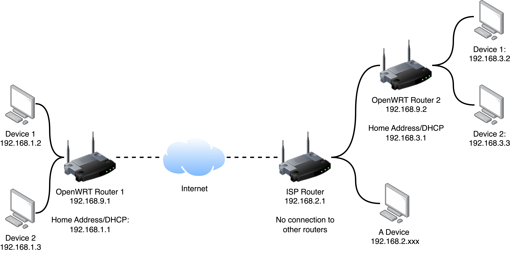

# Two Zigbee Networks joined over a Wireguard VPN
This post is written as part of an assignment for the HAN University of Applied Sciences. This is also part of a few other guides I am posting.
Other guides can be found here:

Controlling Tuya devices locally using Node-Red: `TBD`

Connecting long range sensors using LoRa and MQTT:`TBD`

This guide presumes that you have some basic knowledge of using Home-Assistant and that Home-Assistant is already installed. I am not liable for broken devices, broken configuration, thermonuclear war or ANYTHING ELSE. This guide is provided as is, but feel free to comment on mistakes, inaccuracies and please give suggestions to add to this guide. Nonetheless I hope you find it interesting :D

# Introduction

A few years ago I moved out from my parents home into my own studio. Thats when I also decided that I wanted to install Home-Assistant and make my studio smart. It started with a couple of Zigbee lightbulbs from the Lidl and a Raspberry Pi running Home-Assistant. However I also had a small smarthome setup using and ESP8266 with [Blynk](https://blynk.io/getting-started). Which controlled my lights and an LED-Strip at my parents house. Since I visit my parents regularly I wanted to connect that blynk project to my smarthome. At first I used Node-Red to interface with blynk, but at a certain point it was clear that I had to make new firmware since the original blynk implementation was going to be deprecated since it was a cloud solution. So I wanted to install ESPHome onto that ESP8266, but ESPHome is local and I wanted a secure connection. So I opted to make a VPN-Bridge using Wireguard and two OpenWRT routers. Wireguard can be installed on OpenWRT using its own package manager and is very lightweight. Later I also wanted to have Zigbee devices and sensors on the other side. So I connected a networked Zigbee coordinator at my parents home.

## WireGuard
Wireguard is a very simple and lightweight VPN that uses cryptography with public and private keys. If you are familiar with SSH-Keys and such than this guide is going to be a lot easier to follow. More information on wireguard can be found [here](https://www.wireguard.com/)

## OpenWRT
OpenWRT is an open-source router OS based on Linux. It can be installed on variety of routers and gives you more control over your own network. More information can be found [here](https://openwrt.org/). If you have further questions about OpenWRT I suggest looking at their forum [here](https://forum.openwrt.org/)

## Zigbee
Zigbee is a smarthome mesh protocol. It can be used to control all sorts of smart devices. If you don't know what Zigbee is you can follow along this guide since the Zigbee part is mostly plug and play with the right hardware. However I do recommend for you to read up on what zigbee is in a basic form. A good article on Zigbee can be found [here](https://www.techtarget.com/iotagenda/definition/ZigBee).

# Prerequisites
For this project quite some hardware is needed so some costs are involved, but OpenWRT routers can be bought fairly cheap on second hand. There is also a Wireguard plugin in Home-Assistant, however we won't be using the wireguard implementation there since this guide aims to have two seperate networks joined together from a routers point of view. From Home-Assistants point of view everything looks like one giant network and all Add-Ons and integrations can make use of this very easy without any other configurations necessary.

## Hardware needed
For this project we need two Zigbee coordinators and two routers to join the Zigbee networks.

### Routers
The Routers need to be compatible with OpenWRT. If you already have two routers look at [this](https://openwrt.org/supported_devices) to see if there is an OpenWRT implementation for it. If you don't have a router and don't want to spend to much money I would suggest you find a cheap easy to install in that list. Typically Linksys or TP-link routers work very well with OpenWRT, but make sure to double check the model number.

### Zigbee Coordinators
For this project you need two zigbee coordinators which do have some requirements. Unfortunately you can't just get two of the same Zigbee coordinators and call it a day. Since ZHA doesn't allow for two separate instances with two different coordinators we have to use two separate Zigbee integrations for this. I use Deconz and ZHA. Deconz requires you to use the Conbee II stick. ZHA can use a lot of coordinators, but for our case it is required to use a **NETWORKED** coordinator. Since that is the whole point of setting up WireGuard. I have used a Lidl Zigbee Gateway that I have put different firmware on according to [this](https://paulbanks.org/projects/lidl-zigbee/ha/) guide. I understand that this isn't feasible for almost everyone. An example of a of the shelf gateway that would probably work is the wireless sonoff zigbee gateway (ZBBridge).

## Used Home-Assistant integrations
The Zigbee coordinators have to have its own intergrations.
### Deconz
Deconz is developed by dresden elektronik. It is the main peace of software we need to control our Zigbee setup at the server side. More information can be found [here](https://www.home-assistant.io/integrations/deconz/)
### Zigbee Home Automations
Zigbee home automation or ZHA in short is used to control the Zigbee network at the "client" side of the router. More information on ZHA can be found [here]()
## Example Setup
In this guide I am going to reference my own setup a lot. My Own setup looks something like this:

While wireguard itself doesn't use server and client terminology, but always talks about peers. This setup is using a "server client" configuration. Where the router in my studio is used as a "server". The only difference is that the Server needs a port directly to access the internet. However this is safe since all data is encrypted and there is no direct access from the outside to either routers.

I opted to do it in this way since the "client" peer is behind another router that is used by my parents. I have also set it up this way so I don't have access to my parents devices remotely from my studio and other smart devices since I respect their privacy.

Many thanks to the people who originally helped me on the OpenWRT Forums: [Gopten](https://forum.openwrt.org/u/gopten/summary) and [vgaetera](https://forum.openwrt.org/u/vgaetera/summary).
Link to the original thread where I asked on the OpenWRT forum can be found [here](https://forum.openwrt.org/t/connect-two-routers-with-a-vpn-over-the-internet/114216/4)

# Step 1 - Install OpenWRT
This step is highly dependent on your own setup. I recommend to visit the OpenWRT Supported devices page and look up your router and compatibility [here](https://openwrt.org/supported_devices) and look at the Table of Hardware Section. If you don't have a router yet I would suggest to get a compatible one and look at the installation steps first. It is easiest to get two of the same routers since that makes the installation process same twice.

## Example Setup
In my own setup I used two TP-Link Archer C7 (AC1750) Ver 5.0. The support page mentioned that the firmware can be installed using the firmware uploader in TP-Links own software. So that is what we will do. Do note that there are different versions of this router so keep that in mind everything from V2.0 to V5.0 should be fine. Just download the right one for your router. I have the V5.0 So that is what i'll be using

This tutorial on Youtube is for the Archer A7 but describes the same setup for using the TP-Link interface. If you prefer video you can watch it [here](https://www.youtube.com/watch?v=wrREvRUD9Ng) All credits go to **Behfor**.

The steps I used are the same but I will give a brief summary here:

1. Download the OpenWRT `factor.bin` and `sysupgrade.bin` for your router.
2. Go to your TP-Link Router page by going to the IP-Address of your router usually something like `192.168.0.1` or `192.168.1.1`
3. Go to `Advanced -> System Tools -> Firmware Upgrade` Upload the OpenWRT `factory.bin` and wait.
4. Go to the router page again `192.168.1.1` is standard for OpenWRT. And you should be greeted with a login prompt for OpenWRT. Set your password for OpenWRT
5. Go to `System -> Backup/ Flash Firmware -> Flash new firmware image` Here you should upload the `sysupgrade.bin`. OpenWRT should now be installed. Congratulations

# Step 2 - Install and Setup Wireguard

# Step 3 - Setup Zigbee Networks
